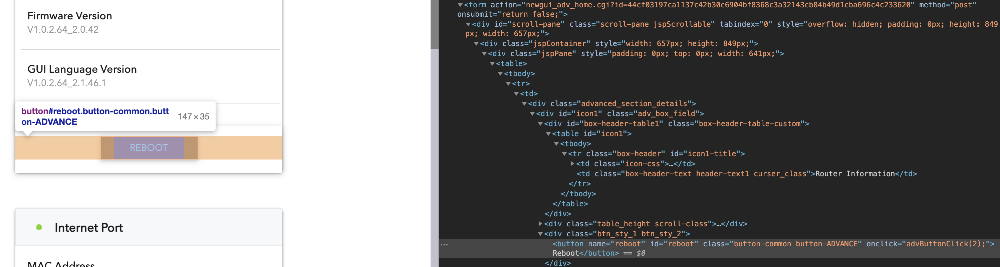
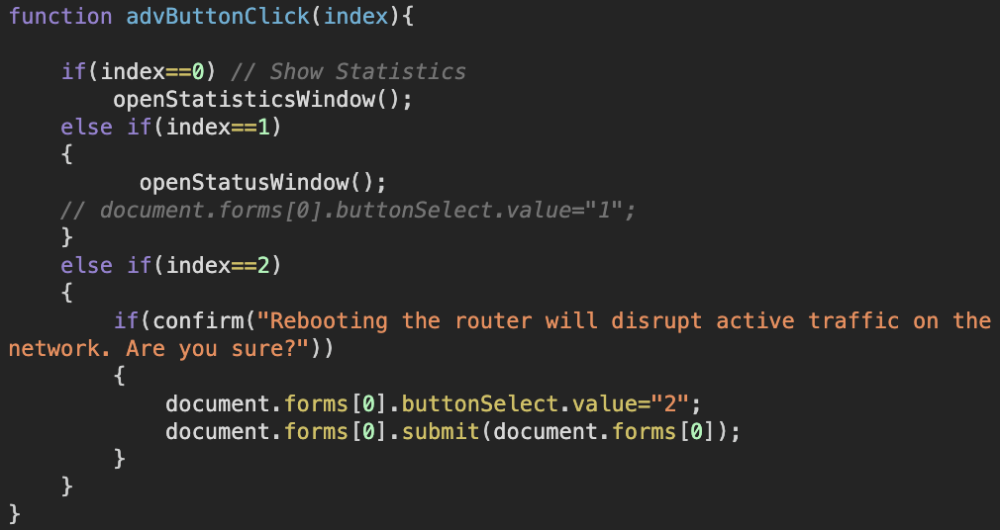
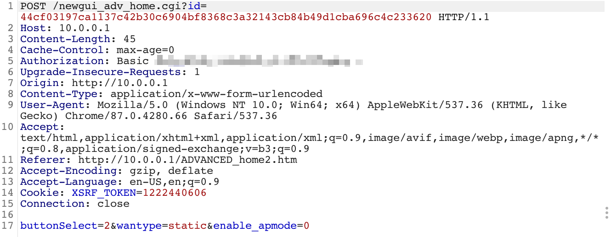

# REBOOT My Netgear Router

## :sunglasses: Getting Started

Make sure you have installed [Ruby](https://www.ruby-lang.org/en/downloads/), and [Bundler](https://bundler.io/)

**Tested on ruby 2.6.3**

1. Clone the repo: `$ git clone https://github.com/fanfannnmn/rebootMyNetgear.git`
2. Install required dependencies: `$ bundler install`
3. Modify `main.rb` with your own credentials
4. Run the Program: `$ ruby main.rb`

## :flushed: How it Works?

### :sleeping: Step 1: Understand

Find the JavaScript function when user clicked the "REBOOT" button.



PS: Button is located at [http://10.0.0.1/ADVANCED_home2.htm](http://10.0.0.1/ADVANCED_home2.htm)

Trace back to the function, and we found the specific JavaScript code for reboot



PS: If you are authenticated, you can use console to reboot by executing:

```
document.forms[0].buttonSelect.value="2";
document.forms[0].submit(document.forms[0]);
```

To be more specific, executing codes above will submit a form to router which tells router that we are "pushing the second button (REBOOT)".

### :confused: Step 2: Find Random Values

By intercepting HTTP POST request multiple times, we found two values were randomized.



#### Query

`POST /newgui_adv_home.cgi?id=44cf03197ca1137c42b30c6904bf8368c3a32143cb84b49d1cba696c4c233620`

#### Cookie

`Cookie: XSRF_TOKEN=1222440606`

### :relaxed: Step 3: Automation

See [main.rb](main.rb)
